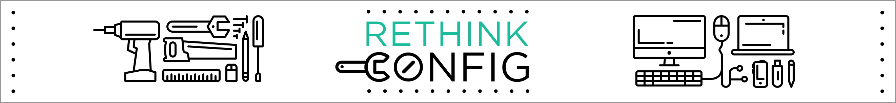

[](https://coveralls.io/github/ChrisCates/rethink-config?branch=master)
[](https://travis-ci.org/ChrisCates/rethink-config)

[](https://nodei.co/npm/rethink-config/)

# rethink-config
## Configure databases, tables and indexes with Rethink Config.
### By Chris Cates :star:
- :mailbox: hello@chriscates.ca
- :computer: http://chriscates.ca

### Features
- Instant setup of your RethinkDB databases
- Able to build databases, tables and indexes.

### Installation
`npm install rethink-config --save`

### Configuration
In order to configure your database look at the following example. This example is also in `test.js` in the root directory of this Git repo.

```javascript
//In the real world you would use var rethinkConfig = require ('rethink-config');
var r = require("rethinkdbdash")();
var rethinkConfig = require ('./index');

rethinkConfig(r, {
  //Specify the database
  "database": "Hello",
  //Specify your tables in an array.
  //Specify your tables in an array.
  "tables": [
    "One",
    // Use an object to specify parameters to table
    { table:"Two", primaryKey:"twoId" },
    "Three"],
  //Specify your indexes in an array
  "indexes": [
    //Each index needs to be specified a table and an index.
    {
      "table": "One",
      "index": "IndexOne"
    },
    {
      "table": "One",
      "index": "IndexTwo"
    },
    {
      "table": "Two",
      "index": "IndexOne"
    }
  ]
}, function(err) {
  if (err) throw err
})
```


#### By Chris Cates
-- Thanks for checking out this npm module. Any questions, email me at hello@chriscates.ca.
